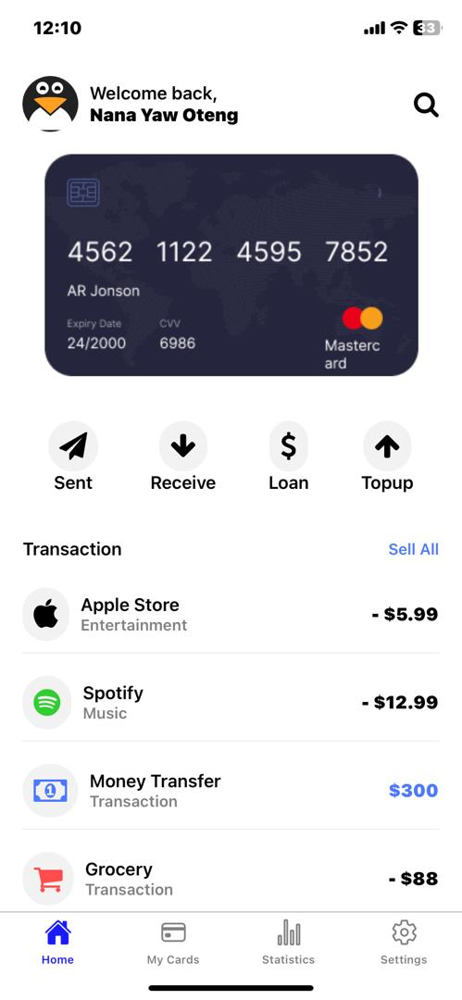
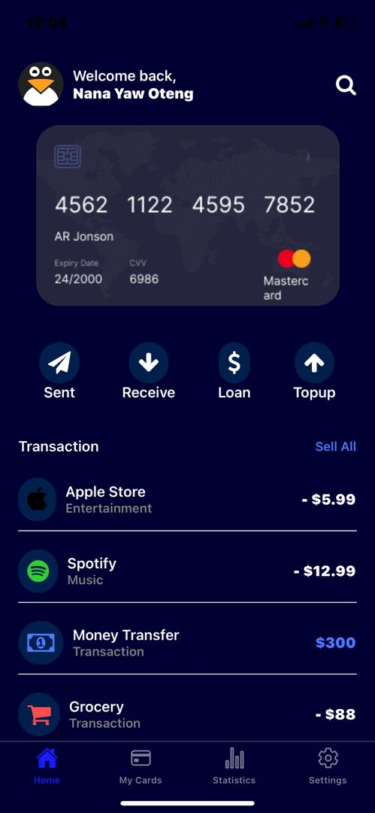
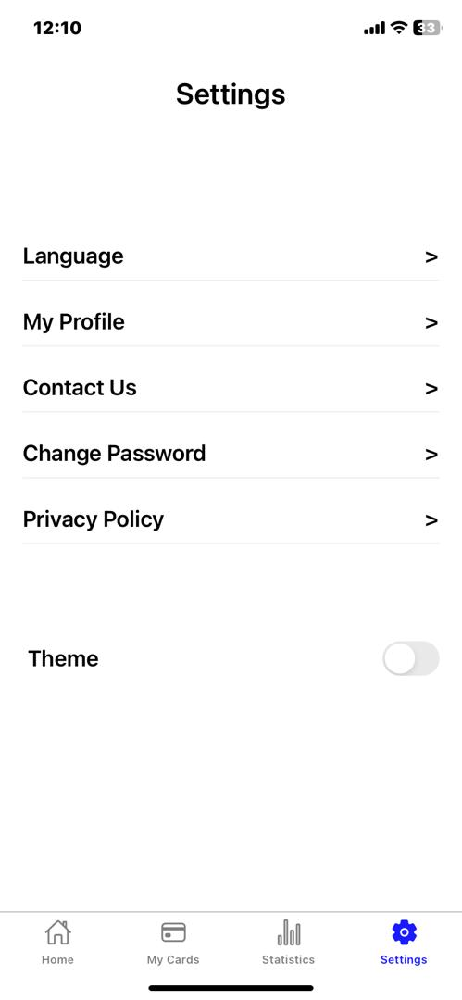
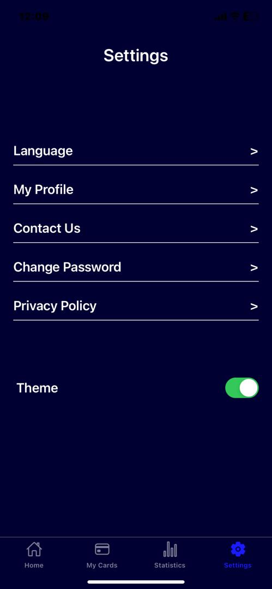

# React Native App for switching themes

This is a React Native application demonstrating a theme switcher feature, allowing users to toggle between light and dark themes. The app includes multiple screens such as Home, My Cards, Statistics and Settings.

### Features

* **Dark Mode toggle**: Users can switch between light and dark themes.
* **Navigation**: Bottom tab navigation between different screens.
* **Dark Mode toggle**: Users can switch between light and dark themes.

### Screens

* **Home Screen**: Displays a welcome message, a profile picture, and transaction actions.
* **My Cards Screen**: Placeholder for managing user cards.
* **Statistics Screen**: Placeholder for displaying statistics.
* **Settings Screen**: Allows users to toggle between light and dark themes and navigate other options.

### Getting Started

_Prerequisites_

* Node.js
* npm or yarn
* React Native CLI or Expo CLI

### Getting Started

* To clone the repository, run the git command  `git clone https://github.com/Nana-Yaw-Oteng/rn-assignment5-11038553` 

* `cd Card` to change to the application's directory after cloning.

* Install the dependencies by running `npm install` or `yarn install`

* The application can be run using Expo Go with the command `npm start`

### Contributions

Contributions and suggestions to improve the project will be wholeheartedly accepted. Happy Coding!!

